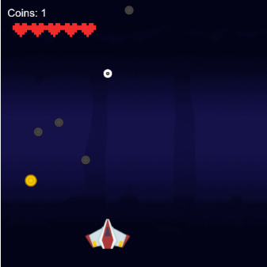

# Explicacao do Jogo

## Link do projeto
[Abrir projeto no Code.org](https://studio.code.org/projects/gamelab/3860b48a-ba21-45ac-ae59-84fcf1d0e700)

## 1. Visao geral
Este jogo eh um mini arcade 2D em que o jogador controla um nave enquanto tenta coletar moedas e evitar sair da tela.

A pontuacão aumenta sempre que uma moeda eh coletada.

---

## 2. Objetivo
- Coletar o maior numero de moedas possivel.
- Desviar dos obstaculos (bombas) que se movem pela tela.
- Manter o personagem dentro dos limites da area de jogo.

---

## 3. Personagens e elementos
- **Player (robo):** personagem principal controlado pelo jogador.
- **Moeda (coin):** item coletavel que soma 1 ponto.
- **Obstaculo:** pedra que cai verticalmente.

---

## 4. Controles
- **Seta para cima:** reduz a queda do robo (ajuda a subir/manter altura).
- **Seta para esquerda:** move o robo para a esquerda.
- **Seta para direita:** move o robo para a direita.

---

## 5. Regras e mecanicas
### 5.1 Gravidade
A cada frame, a velocidade vertical do player aumenta um pouco, simulando queda.

### 5.2 Movimento dos obstaculos
- O obstaculo vertical reaparece no topo quando sai da tela.
- O obstaculo horizontal reaparece na lateral quando sai da tela.
- Em cada reposicionamento, a coordenada secundaria eh sorteada para variar a dificuldade.

### 5.3 Coleta de moeda
Quando o player toca na moeda:
- A pontuacao aumenta em 1.
- A moeda atual some.
- Uma nova moeda aparece em posicao aleatoria.

### 5.4 Colisao com obstaculos
Ao tocar nos obstaculos, o player colide com eles (nao atravessa).

---

## 6. Sistema de pontuacao
A pontuacao aparece no canto superior esquerdo com o texto:
- `Pontos: <valor>`

Cada moeda coletada incrementa esse valor em +1.

---

## 7. Condicao de fim de jogo
O jogo termina quando o player sai dos limites da tela (para cima, baixo, esquerda ou direita).

Ao terminar:
- O fundo fica preto.
- A mensagem `Game Over!` aparece na tela.

---
