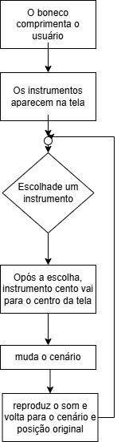

# Projeto Semana 02

O objeto da semana 02 era uma forma de cumprimentar outra pessoa. Fiz um projeto no qual um boneco cumprimenta o jogador e apresenta uma série de instrumentos, ao clica-los o instrumento viaja para o meio da tela, troca o cenário, emite seu som e volta para sua posição original.

## Fluxograma

## Funcionamento Prático

<video controls width="640">
  <source src="Video_Funcionamento.mp4" type="video/mp4">
  Seu navegador não suporta vídeo.
</video>

