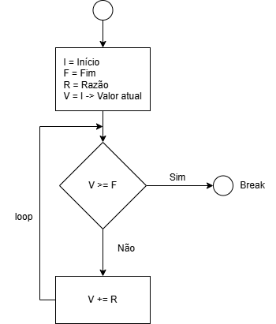

# Semana 03

O objetivo da semana 03 se consistia em, criar um programa que resolvesse uma função matemática usando a linguagem do Litte Man Computer.

Fiz uma progressão onde dado um valor inicial, um valor final e uma razão, o código vai do valor inicial até o valor final saltando de acordo com a razão.

Exemplo, I = 0, F = 10, R = 2
Teremos um conjunto {0,2,4,6,8,10}
---
### Fluxograma


### Abaixo o código desenvolvido com alguns comentários sobre seu funcionamento
> Logo depois, código sem comentários.

```
        INP             // Lê o valor inicial
        STA inicio      // Salva em 'inicio'
        
        INP             // Lê o valor final
        STA limite      // Salva em 'limite'
        
        INP             // Lê a razão/pulo (Corrigido 'INPa' para 'INP')
        STA salto       // Salva em 'salto'
        
        LDA inicio      // Carrega o valor inicial para começar a conta
loopSalto STA atual     // Salva o valor que será processado agora
        OUT             // Exibe o número atual no Output

        LDA atual       // Pega o número que acabou de mostrar
        SUB limite      // Faz: (atual - limite)
        BRP fim         // Se (atual >= limite), pula para o fim do programa

        LDA atual       // Se não parou, pega o atual de volta
        ADD salto       // Soma o valor do pulo/razão
        BRA loopSalto   // Volta para o início do laço para mostrar o novo valor

fim     HLT             // Para a execução

inicio  DAT             // Reserva espaço para o início
salto   DAT             // Reserva espaço para o valor do pulo
limite  DAT             // Reserva espaço para o limite máximo
atual   DAT             // Reserva espaço para o contador atual

```
### Código sem comentários

```
	INP
        STA inicio
        INP
        STA limite
        INP
        STA salto

        LDA inicio
loopSalto STA atual
        OUT

        LDA atual
        SUB limite
        BRP fim

        LDA atual
        ADD salto
        BRA loopSalto

fim     HLT

inicio  DAT
salto   DAT
limite  DAT
atual   DAT       
```