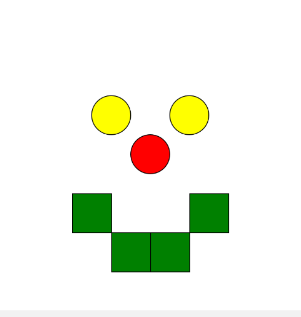
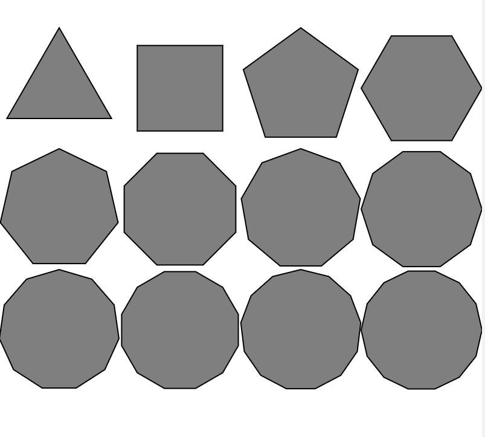
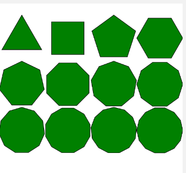
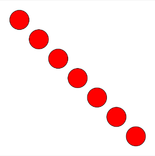
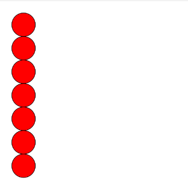

# Semana 4

Nesta semana iniciamos as atividades no Code.org, com foco em programacao no Laboratorio de Jogos usando JavaScript e blocos visuais.

Foram concluidos os modulos 1, 2 e 3.

## Visao Geral dos Arquivos

- img_m1/esboco_de_um_rosto.png: atividade de desenho com formas basicas e cores.
- img_m2/imagem_ref_M2.png: imagem de referencia do exercicio de poligonos.
- img_m2/imagem_M2.png: imagem produzida no exercicio de poligonos.
- img_m3/pontilhado_diagonal.png: padrao de circulos em diagonal.
- img_m3/pontilhado_reto.png: padrao de circulos em linha vertical.

---

## Modulo 1 - Desenho no Laboratorio de Jogos

### Objetivo

Introduzir o ambiente do Code.org, praticando desenho com formas geometricas e definicao de cores.

### Exemplo

Proposta: desenhar o esboco de um rosto usando circulos e retangulos.

```JavaScript
fill("yellow");                 // Define que o próximo item adicionado terá a cor
                                // amarela
ellipse(150, 150);              // Cria uma eclipse na posição X = 150 e Y = 150px 
                                // de tamanho por padrão, 50px por 50px.

fill("yellow");                 // Define que o proximo item adicionado tera a cor
                                // amarela 
ellipse(250, 150);              // Cria uma eclipse na posição X = 250 e Y = 150px
                                // de tamanho padrão, 50px por 50px.

fill("red");                    // Define que o proximo item adicionado tera a cor
                                // vermelha 
ellipse(200, 200);              // Cria uma eclipse na posição X = 200 e Y = 200px
                                // de tamanho
                                // padrão 50px por 50px

fill("green");                  // Define que o proximo item adicionado tera a cor
                                // verde 
rect(200, 300);                 // Cria um retângulo na posição X = 200 e Y = 300
rect(150, 300);                 // Cria um retângulo na posição X = 150 e Y = 300
rect(100, 250);                 // Cria um retângulo na posição X = 100 e Y = 250
rect(250, 250);                 // Cria um retângulo na posição X = 250 e Y = 250
```
---
#### Imagem Exemplo
<div align="center">
    
</div>

---

## Modulo 2 - Formas e Parametros

### Objetivo

Compreender parametros de desenho e construir poligonos regulares com diferentes numeros de lados.

### Exemplo

Proposta: reproduzir a imagem de referencia variando o parametro de lados no bloco regularPolygon.

```javascript
fill("green");
// regularPolygon(x, y, lados, tamanho)
regularPolygon(50, 75, 3, 50);
regularPolygon(150, 75, 4, 50);
regularPolygon(250, 75, 5, 50);
regularPolygon(350, 75, 6, 50);
regularPolygon(50, 175, 7, 50);
regularPolygon(150, 175, 8, 50);
regularPolygon(250, 175, 9, 50);
regularPolygon(350, 175, 10, 50);
regularPolygon(50, 275, 11, 50);
regularPolygon(150, 275, 12, 50);
regularPolygon(250, 275, 13, 50);
regularPolygon(350, 275, 14, 50);
```

### Resultado

<div align="center">
    
    
    <figcaption>Da esquerda para a direita: referencia e resultado obtido.</figcaption>
</div>

---

## Modulo 3 - Variaveis

### Objetivo

Entender como variaveis controlam posicao e repeticao de elementos no desenho.

### Exemplo

Proposta: alterar apenas as variaveis para criar diferentes padroes de circulos.

```javascript
var x = 50;
var y = 50;

fill("red");
ellipse(x, y);
y = y + 50;
// x = x;/ Increase x by 50, now x is 100
ellipse(x, y);
// x = x + 50;
y = y + 50;
ellipse(x, y);
// x = x + 50;
y = y + 50;
ellipse(x, y, 50, 50);
// x = x + 50;
y = y + 50;
ellipse(x, y, 50, 50);
// x = x  + 50;
y = y + 50;
ellipse(x, y, 50, 50);
// x = x + 50;
y = y + 50;
ellipse(x, y, 50, 50);
```

### Resultado

<div align="center">
    
    
    <figcaption>Variacao de padroes alterando as variaveis de posicao.</figcaption>
</div>

---

