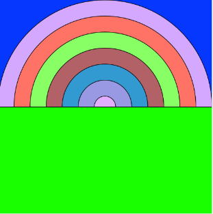
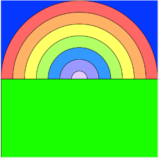
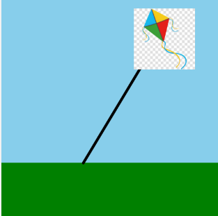
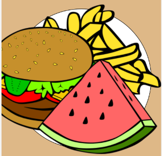
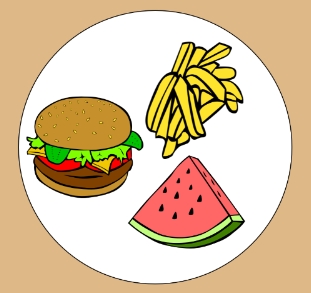

# Semana 5

Continuacao das atividades no Code.org, com foco em geracao aleatoria, sprites e propriedades de sprites.

Foram concluidos os modulos 4, 5 e 6.

## Visao Geral dos Arquivos

- img_m4/arcoiris_aleatorio.png: imagem gerada com cores aleatorias.
- img_m4/arcoiris_original.png: referencia do arco-iris.
- img_m5/cena_pipa.png: cena com sprite da pipa (kite).
- img_m6/prato_baguncado.png: cena inicial com sprites grandes.
- img_m6/prato_organizado.png: cena ajustada usando proprietes de sprite.

---

## Modulo 4 - Números Aleatórios

### Objetivo

Usar o bloco `randomNumber` para alterar cores e propriedades de forma aleatoria e observar variacoes visuais.

### Exemplo

Gerar um conjunto de circulos concêntricos com cores definidas por valores RGB aleatorios.

```javascript
background(rgb(5, 55, 255));
// Define o fundo com uma cor RGB fixa
background(rgb(5, 55, 255));

// Cada bloco abaixo define a cor de preenchimento usando canais RGB,
// onde alguns canais sao gerados aleatoriamente com `randomNumber(0,255)`.
// Em seguida desenha um elipse concêntrico decrescendo de tamanho.
fill(rgb(randomNumber(0, 255), randomNumber(0, 255), 255));
// Círculo maior (fundo/anel externo)
ellipse(200, 200, 400, 400);

fill(rgb(255, randomNumber(0, 255), 102));
// Segundo círculo concêntrico
ellipse(200, 200, 340, 340);

fill(rgb(randomNumber(0, 255), 255, 102));
// Terceiro círculo concêntrico
ellipse(200, 200, 280, 280);

fill(rgb(178, randomNumber(0, 255), 102));
// Quarto círculo concêntrico
ellipse(200, 200, 220, 220);

fill(rgb(51, 153, randomNumber(0, 255)));
// Quinto círculo concêntrico
ellipse(200, 200, 160, 160);

fill(rgb(153, 153, randomNumber(0, 255)));
// Sexto círculo concêntrico
ellipse(200, 200, 100, 100);

fill(rgb(randomNumber(0, 255), randomNumber(0, 255), 255));
// Centro menor
ellipse(200, 200, 40, 40);

// Desenha o chao/retangulo inferior (base da cena)
fill(rgb(25, 255, 0));
rect(0, 200, 400, 200);
```

### Resultado

<div align="center">
    
    
    <figcaption>Da esquerda para a direita: resultado aleatorio e referencia.</figcaption>
</div>

---

## Modulo 5 - Sprite

### Objetivo

Aprender a criar sprites a partir de imagens e utilizar as funcoes basicas para posiciona-los e desenha-los na cena.

### Exemplo

Criar um sprite para representar uma pipa, ajustar a animacao e posiciona-lo na cena.

```javascript
var kite = createSprite(300, 50);
// Cria um sprite na posicao (300, 50)
kite.setAnimation("pipa.jpg_1"); // Associa a imagem/animacao ao sprite

// Desenha o fundo da cena
background("skyblue");

// Desenha a area de grama / chao
fill("green");
noStroke();
rect(0, 300, 400, 100);

// Desenha a linha que representa a corda da pipa
stroke("black");
strokeWeight(5);
line(150, 300, 300, 50);

// Renderiza todos os sprites criados
drawSprites();
```

### Resultado

<div align="center">
    
    <figcaption>Imagem produzida com o sprite da pipa.</figcaption>
</div>

---

## Modulo 6 - Propriedades de Sprite

### Objetivo

Explorar propriedades como `sprite.x`, `sprite.y`, `sprite.rotation` e `sprite.scale` para ajustar aparencia e posicao dos sprites.

### Exemplo

Ajustar escala e rotacao de sprites (ex.: batatas fritas, hamburger, sobremesa) para que eles caibam melhor no prato.

```javascript
background("burlywood");
// Desenha o fundo do prato
background("burlywood");

// Desenha o prato (circulo branco grande)
fill("white");
ellipse(200, 200, 350);

// Cria o sprite das batatas fritas e ajusta propriedades
var fries = createSprite(250, 140);
fries.setAnimation("fries");
fries.scale = 0.5;    // reduz o tamanho do sprite
fries.rotation = 90;  // gira o sprite para melhor posicao

// Cria o sprite do hamburger e ajusta escala
var burger = createSprite(110, 200);
burger.setAnimation("burger");
burger.scale = 0.5;

// Cria o sprite da sobremesa e ajusta escala
var dessert = createSprite(240, 270);
dessert.setAnimation("watermelon");
dessert.scale = 0.5;

// Renderiza os sprites na tela
drawSprites();
```

### Resultado

<div align="center">
    
    
    <figcaption>Da esquerda para a direita: antes e depois de ajustar propriedades.</figcaption>
</div>

---

